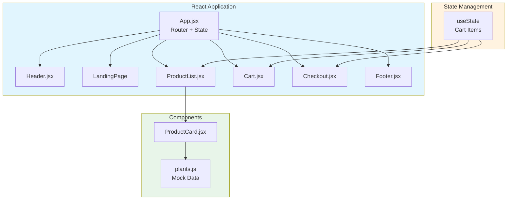
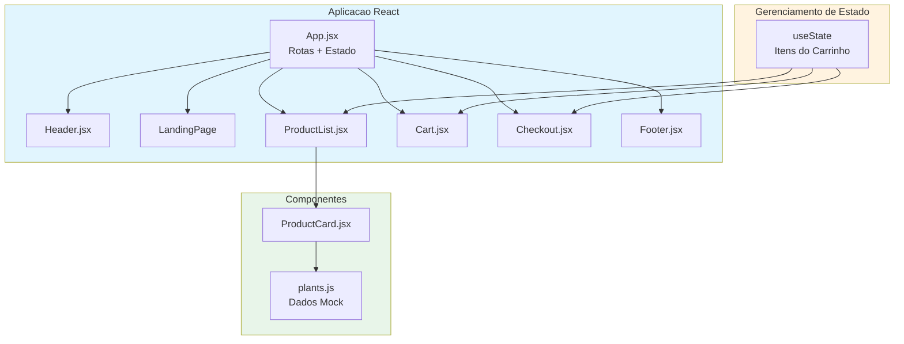

# Paradise Nursery

> Coursera - IBM Full-Stack JavaScript Developer

[](LICENSE)
[](https://reactjs.org)

[English](#english) | [Portugues](#portugues)

---

## English

### Overview

**Paradise Nursery** is a React-based e-commerce application for browsing and purchasing plants. It features a product catalog with 22+ plants across multiple categories, a shopping cart with quantity management, and a checkout flow.

### Key Features

- **Product Catalog**: 22 plants with images, prices, descriptions, and categories
- **Category Filtering**: Filter plants by Indoor, Outdoor, Succulent, and Aromatic
- **Search**: Real-time text search across plant names and descriptions
- **Shopping Cart**: Add/remove items, adjust quantities, view order summary
- **Checkout**: Shipping and payment form with order review
- **Responsive Design**: Works across desktop and mobile viewports

### Architecture



### Quick Start

```bash
git clone https://github.com/galafis/Paradise-Nursery.git
cd Paradise-Nursery
npm install
npm start
```

### Project Structure

```
Paradise-Nursery/
├── public/
│   └── index.html
├── src/
│   ├── components/
│   │   ├── Header.jsx
│   │   ├── Footer.jsx
│   │   ├── ProductCard.jsx
│   │   ├── ProductList.jsx
│   │   ├── Cart.jsx
│   │   └── Checkout.jsx
│   ├── data/
│   │   └── plants.js
│   ├── App.jsx
│   └── index.js
├── package.json
└── README.md
```

### Tech Stack

| Technology       | Role                 |
|-----------------|----------------------|
| React 18        | UI framework         |
| React Router v6 | Client-side routing  |
| JavaScript ES6+ | Programming language |

### License

This project is licensed under the MIT License - see the [LICENSE](LICENSE) file for details.

### Author

**Gabriel Demetrios Lafis**
- GitHub: [@galafis](https://github.com/galafis)
- LinkedIn: [Gabriel Demetrios Lafis](https://linkedin.com/in/gabriel-demetrios-lafis)

---

## Portugues

### Visao Geral

**Paradise Nursery** e uma aplicacao e-commerce em React para navegar e comprar plantas. Possui um catalogo de produtos com 22+ plantas em multiplas categorias, carrinho de compras com gerenciamento de quantidade e fluxo de checkout.

### Funcionalidades Principais

- **Catalogo de Produtos**: 22 plantas com imagens, precos, descricoes e categorias
- **Filtro por Categoria**: Filtre plantas por Indoor, Outdoor, Suculenta e Aromatica
- **Busca**: Pesquisa em tempo real por nome e descricao
- **Carrinho de Compras**: Adicionar/remover itens, ajustar quantidades, ver resumo do pedido
- **Checkout**: Formulario de envio e pagamento com revisao do pedido
- **Design Responsivo**: Funciona em desktop e dispositivos moveis

### Arquitetura



### Inicio Rapido

```bash
git clone https://github.com/galafis/Paradise-Nursery.git
cd Paradise-Nursery
npm install
npm start
```

### Licenca

Este projeto esta licenciado sob a Licenca MIT - veja o arquivo [LICENSE](LICENSE) para detalhes.

### Autor

**Gabriel Demetrios Lafis**
- GitHub: [@galafis](https://github.com/galafis)
- LinkedIn: [Gabriel Demetrios Lafis](https://linkedin.com/in/gabriel-demetrios-lafis)
